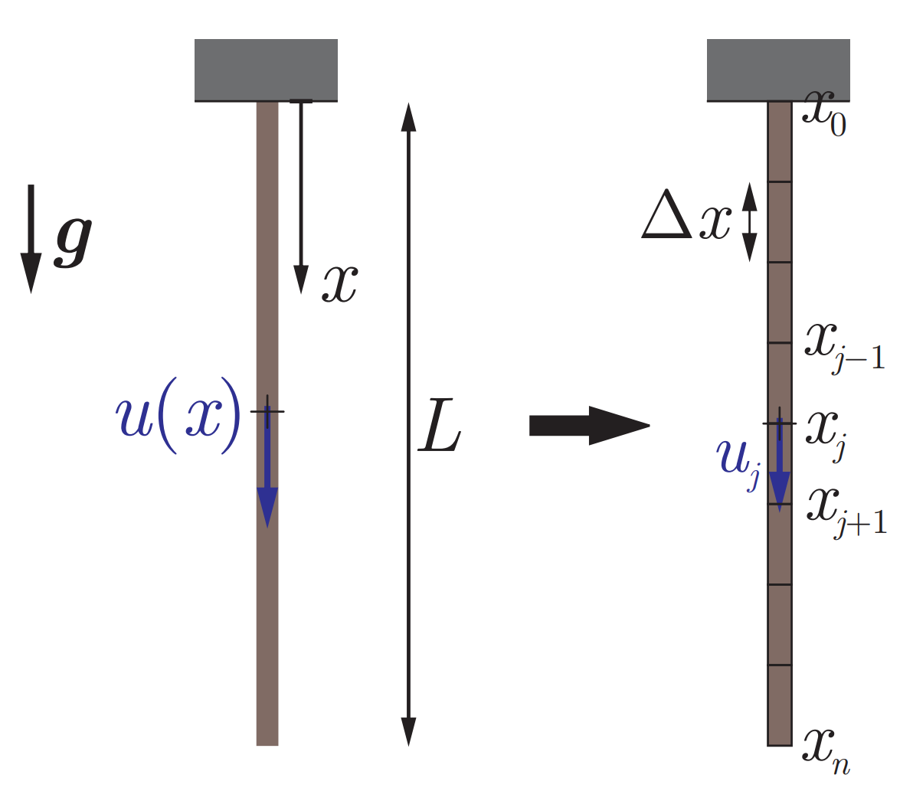

# Example 3.2 Bar under its own weight
## Problem Type: Static

## Physical parameters
- Young's modulus $E$
- Cross-sectional area $A$
- Length $L$

## Governing Equation
Linear Momentum Balance:
$$\mathrm{div}\;\sigma + \rho g = 0$$
We use the constitutive law $\sigma = E \varepsilon$ and the definition of strain for small deformation $\varepsilon = \frac{du}{dx}$ to write:
$$\sigma = E \frac{du}{dx}$$
Therefore, the linear momentum becomes:
$$\frac{d^2u}{dx^2} = -\frac{\rho g}{E}$$
The boundary conditions are
$$u(x=0)=0$$
$$\frac{du}{dx}(x=L)=0$$

## Analytical Solution
$$u(x) = -\frac{\rho g}{2E}x(x-2L)$$

## Numerical Solution
Second order central difference scheme
$$\frac{d^2u}{dx^2}\approx \frac{u_{i+1}-2u_i + u_{i-1}}{(\Delta x)^2} = -\frac{\rho g}{E}$$
Rearranging all the constants to one side. Define $c=-\frac{\rho g}{E} (\Delta x)^2$:
$$u_{i+1}-2u_i + u_{i-1} = c$$
Impose boundary conditions 
$$u_0=0$$
$$\frac{u_{N}-u_{N-1}}{\Delta x} = 0$$
So the system of equations look like $[1, -2, 1]$ on the diagonal, with the first and last row being $u_0=0$ and $u_N = u_{N-1}$

## Code Output from [main.py](main.py)
[bar_under_gravity.pdf](bar_under_gravity.pdf)