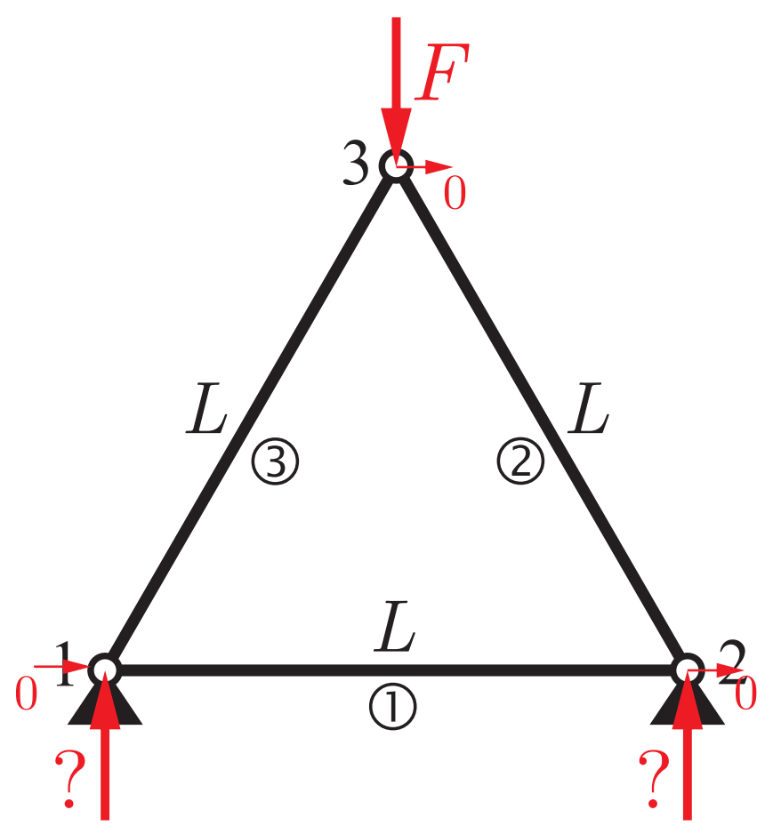
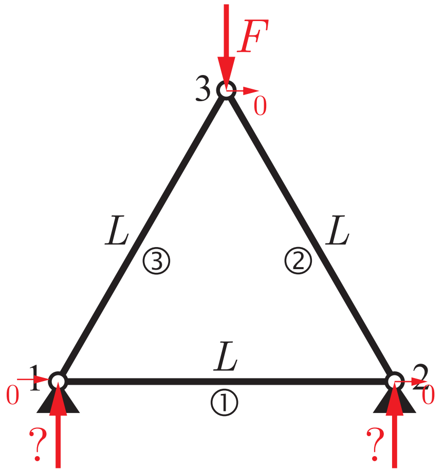
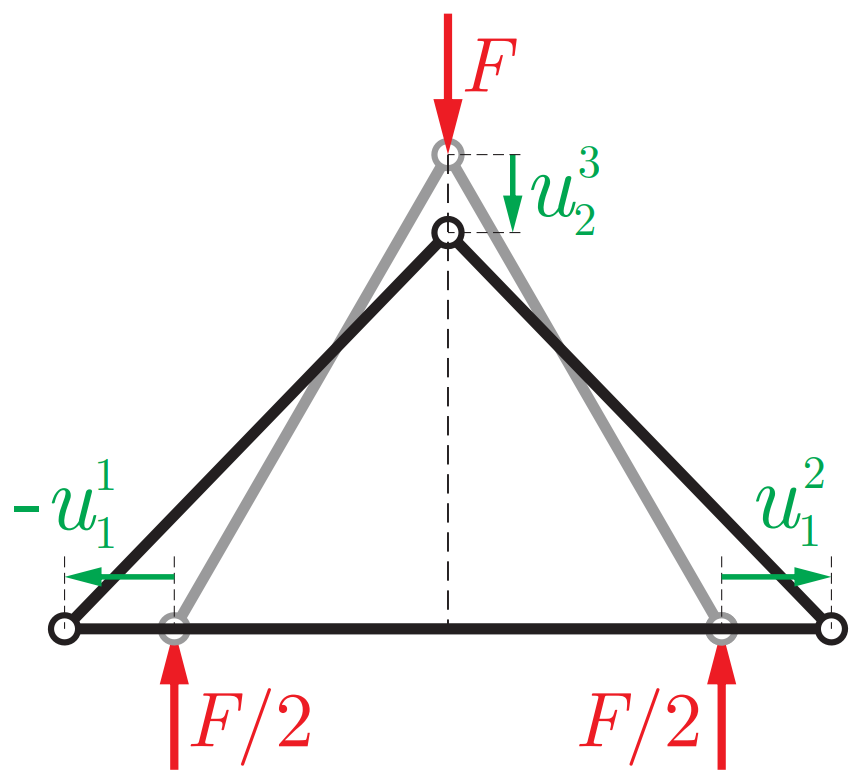

# Example 5.1 Truss consisting of three bars in 2D
## Problem Type: Static

## Physical parameters
- Young's modulus $E$
- Cross-sectional area $A$

## 2D Bar Stiffness Matrix
The 1D bar stiffness matrix is:
$$\mathbf{\tilde K}_e=\frac{EA}{\Delta x_e}
\begin{equation*}
\begin{bmatrix}
    1 & -1 \\
    -1 & 1
\end{bmatrix}
\end{equation*}$$
The general 2D stiffness matrix of a bar element is:
$$\begin{equation*}
    \mathbf{K}_e = \mathbf R^\top(\varphi_e) \mathbf{\tilde K}_e \mathbf R(\varphi_e)
\end{equation*}$$
where the rotation matrix is:
$$\begin{equation*}
    \mathbf R(\varphi_e)=\begin{bmatrix}
        \cos\varphi_e & \sin\varphi_e & 0 & 0 \\
        0 & 0 & \cos\varphi_e & \sin\varphi_e
    \end{bmatrix}
\end{equation*}$$

## Stiffness matrices for each element in the problem
$$\mathbf K_1 = \mathbf R^\top (0)\mathbf{\tilde K}_e\mathbf R(0)$$
$$\mathbf K_2 = \mathbf R^\top (\tfrac{2\pi}{3})\mathbf{\tilde K}_e\mathbf R(\tfrac{2\pi}{3})$$
$$\mathbf K_3 = \mathbf R^\top (\tfrac{\pi}{3})\mathbf{\tilde K}_e\mathbf R(\tfrac{\pi}{3})$$

## Global Stiffness Matrix
$$\mathbf K = \sum_{i=1}^3 \mathbf K_i$$

## Force Vector

Let us denote the DOFs as 
$$\mathbf U=[u_1^1, u_2^1, u_1^2, u_2^2, u_1^3, u_2^3]^\top$$
where subscript denotes the direction $e_1, e_2$, and the superscript denotes the node indices. 

The global force vector is
$$\mathbf F = [0, ?, 0, ?, 0, -F]^\top$$
We can impose boundary conditions 
$$\begin{equation*}
    \begin{cases}
        u_2^1 = 0 \\
        u_2^2 = 0
    \end{cases}
\end{equation*}$$
However, this is not enough to eliminate the rigid body motions in the global stiffness matrix. We also have to eliminate the horizontal translation. So we can arbitrarily set $u_1^3=0$, which will give a symmetric solution like the following diagram:

Moreover, after computing the solution, we can calculate for $\mathbf F_\mathrm{ext}=\mathbf K\mathbf U$. For the symmetric solution case, we should find that the reaction forces for nodes 1 and 2 are exactly $F/2$. 

On the other hand, one can choose to set for example $u_1^1 = 0$ instead of $u_1^3=0$, which would give a non-symmetric solution
## Numerical Results from [main.py](main.py)
[symmetric_deformation.pdf](symmetric_deformation.pdf)

[nonsymmetric_deformation.pdf](nonsymmetric_deformation.pdf)