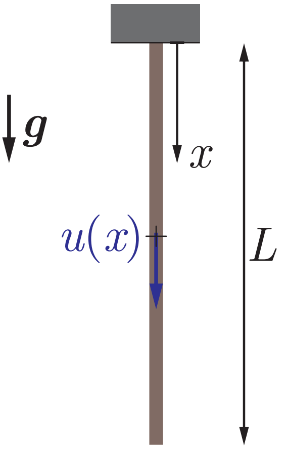

# Rayleigh Ritz of Hanging Bar

## Energy Functional
Approximate solution $u\approx u^h(x)$, the energy functional is
$$
\newcommand{\lpar}{\left (}
\newcommand{\rpar}{\right )}

I[u^h] = \int_0^L \frac{1}{2}E \lpar\frac{\partial u^h}{\partial x}\rpar^2 A \; dx - \int_0^L \rho g u^h(x) A \; dx$$
Choose the polynomial ansatz
$$u^h(x) = \sum_{a=1}^n u^a x^a$$
where we have the boundary condition $u^0=0$

Next, if we differentiate with respect to the coefficients $u^a$:
$$\frac{\partial I[u^h]}{\partial u^a}=0 \quad \text{for }\; a = 1, \dots, n$$
The resulting system of stationarity equation is $\mathbf K \mathbf U = \mathbf F$:
$$ \newcommand{\B}{\mathcal B}
\begin{align*}
    K^{ab} = \B[N^a, N^b] = \B[x^a, x^b] &= \int_0^L E\frac{\partial x^a}{\partial x} \frac{\partial x^b}{\partial x} A \; dx \\
    &= \int_0^L Eax^{a-1}bx^{b-1} A \; dx \\
    &= abEA\frac{L^{a+b-1}}{a+b-1}
\end{align*}$$
and 
$$ \newcommand{\L}{\mathcal L}
F^a = \L[N^a] = \L[x^a] = \int_0^L \rho g x^a A \; dx = \rho g A \frac{L^{a+1}}{a+1}$$

Solving the system of equation above with $n=1$ yields a linear solution
$$K^{11}u^1 = F^1 \quad \Longrightarrow \quad EALu^1 = \frac{1}{2}\rho g A L^2 \quad \Longrightarrow \quad u^h(x) = u^1x = \frac{\rho g L}{2E}x$$

Solving the above with any $n\geq 2$ yields the exact solution
$$u_\mathrm{exact} = \frac{\rho g}{2E}(2L-x)x$$

## Numerical Results from [main.py](main.py)
[deflection.pdf](deflection.pdf)