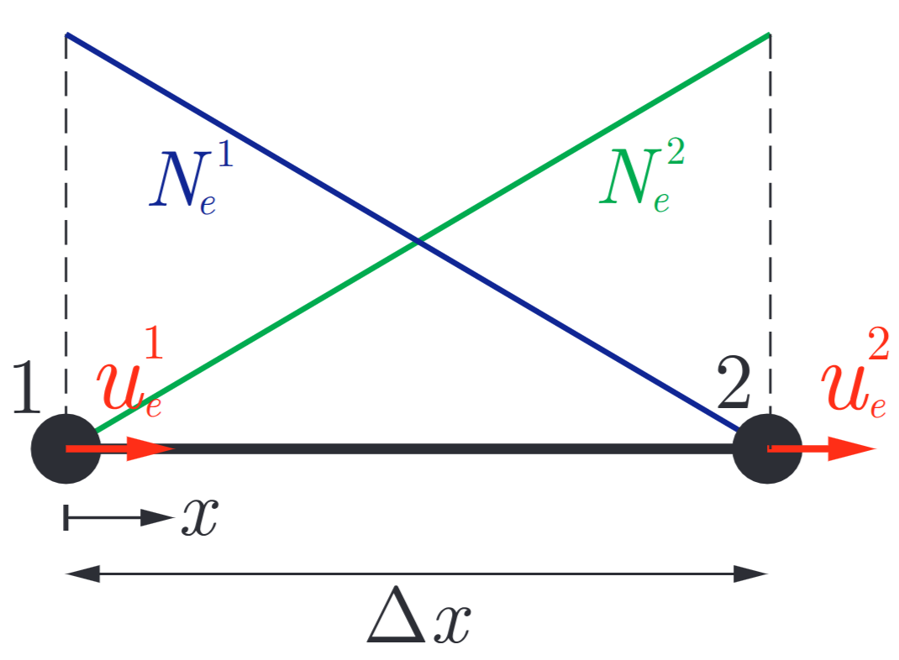

### 2-Node Bar Element


## Shape Function
We need two shape functions for the interpolation of the element DOFs $\mathbf U_e = [u_e^1, u_e^2]$ so that 
$$u_e^h(x) = N_e^1(x) u_e^1 + N_e^2(x) u_e^2$$
We must impose $u_e^h(0) = u_e^1$ and $u_e^h(\Delta x) = u_e^2$

We choose $q=1$ (linear shape function). We must have an interpolation type of 
$$u_e^h(x) = c_e^1 + c_e^2x$$
The element shape functions are
$$N_e^1(x) = 1-\frac{x}{\Delta x} \qquad N_e^2(x) = \frac{x}{\Delta x}$$
We can group the DOFs into the vector $\mathbf U_e=[u_e^1, u_e^2]^\top$:

$$u_e^h(x) = \mathbf N_e \mathbf U_e \quad \text{with} \quad \mathbf N_e=\left[1-\frac{x}{\Delta x}, \frac{x}{\Delta x}\right]$$

The stiffness matrix can be obtained as 
$$K_e^{ab} = \mathcal B[N_e^a, N_e^b] = \int_0^{\Delta x} EN_{e,x}^aN_{e,x}^b A \; dx = EA\Delta x N_{e,x}^aN_{e,x}^b = \frac{EA}{\Delta x}\begin{cases}
    1 & \text{if }a=b \\
    -1 & \text{else}
\end{cases}$$
Hence the element stiffness matrix is
$$\mathbf K_e = \frac{EA}{\Delta x} \begin{bmatrix}
    1 & -1 \\
    -1 & 1
\end{bmatrix}$$
The self-weight load vector can be derived accordingly
$$\begin{align*}
    F^a_e &= \mathcal L[N_e^a] = \int_0^{\Delta x} \rho g N_e^a A \; dx = \rho g A \int_0^{\Delta x} 1-\frac{x}{\Delta x} \; dx = \rho g A \frac{\Delta x}{2} \\
    F^b_e &= \mathcal L[N_e^b] = \int_0^{\Delta x} \rho g N_e^b A \; dx = \rho g A \int_0^{\Delta x} \frac{x}{\Delta x} \; dx = \rho g A \frac{\Delta x}{2}
\end{align*}$$

## Assembly Procedure
This is a 1D bar, so we add the stiffness matrices at the (1,1) and (2,2) spots. Similarily for the load vector. The code snippet is attached below, which is also used inside [main.py](main.py)
```python
    # Assemble global stiffness matrix
    K = np.zeros((N+1, N+1))
    for i in range(N):
        Ke_i = Ke(E, A, dx)
        K[i:i+2, i:i+2] += Ke_i

    # Load vector (self-weight)
    w = rho * g * A # N/m
    F = np.zeros(N+1)
    for i in range(N):
        F[i] += w * dx / 2
        F[i+1] += w * dx / 2
```


## Numerical Setup and Boundary Conditions
Discretize the 1D bar into $N$ numbers of 2-Node Bar Elements. 
There are $N+1$ nodes, labeled from $0$ to $N$ (from top to bottom). 
The Dirichlet boundary condition is 
$$u(0)=0$$
The free-end has the natural boundary condition of 
$$u'(L) = 0$$

## Numerical Result
[FEM_Solution.pdf](FEM_Solution.pdf)