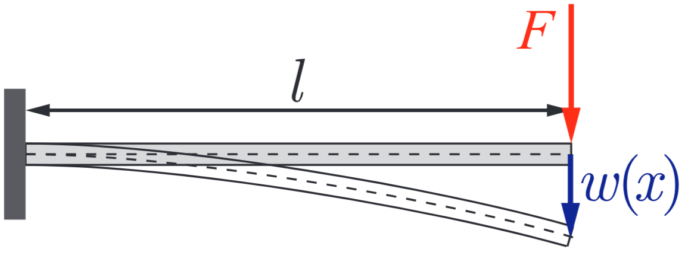

# Cantilever Beam

## Timoshenko Beam Stiffness Matrix (in 2D)
The element stiffness matrix for Timoshenko beam element in 1D is
$$
\begin{equation*}
    \mathbf{\tilde K}_e = \frac{EI_y}{L_e^3(1+\phi)}
    \begin{bmatrix}
        12 & 6L_e & -12 & 6L_e \\
        6L_e & (4+\phi)L_e^2 & -6L_e & (2-\phi)L_e^2 \\
        -12 & -6L_e & 12 & -6L_e \\
        6L_e & (2-\phi)L_e^2 & -6L_e & (4+\phi)L_e^2
    \end{bmatrix}
\end{equation*} \quad \text{with} \quad \phi=\frac{12EI_y}{\kappa GA L_e^2}
$$
where $\phi$ is the dimensionless ratio of bending vs shear stiffness of the beam. As $\phi\to 0$, the above recovers the Euler-Bernoulli stiffness matrix. 

We can extend the above 1D stiffness matrix to 2D by superposing it with a bar element
$$
\begin{equation*}
    \mathbf{\tilde K}_e = \frac{EI_y}{L_e^3(1+\phi)}
    \begin{bmatrix}
        0 & 0 & 0 & 0 & 0 & 0 \\
        0 & 12 & 6L_e & 0 & -12 & 6L_e \\
        0 & 6L_e & (4+\phi)L_e^2 & 0 & -6L_e & (2-\phi)L_e^2 \\
        0 & 0 & 0 & 0 & 0 & 0 \\
        0 & -12 & -6L_e & 0 & 12 & -6L_e \\
        0 & 6L_e & (2-\phi)L_e^2 & 0 & -6L_e & (4+\phi)L_e^2
    \end{bmatrix} + \frac{EA}{L_e}\begin{bmatrix}
        1 & 0 & 0 & -1 & 0 & 0 \\
        0 & 0 & 0 & 0 & 0 & 0 \\
        0 & 0 & 0 & 0 & 0 & 0 \\
        -1 & 0 & 0 & 1 & 0 & 0 \\
        0 & 0 & 0 & 0 & 0 & 0 \\
        0 & 0 & 0 & 0 & 0 & 0 \\
    \end{bmatrix}
\end{equation*}
$$
For completeness, for a 2D beam element in arbitrary orientation, we can use the rotation matrix below
$$
\begin{equation*}
    \mathbf R(\varphi_e) = 
    \begin{bmatrix}
        \cos \varphi_e & \sin\varphi_e & 0 \\
        -\sin\varphi_e & \cos\varphi_e & 0 \\
        0              & 0             & 1 \\
                       &               &   & \cos \varphi_e & \sin\varphi_e & 0 \\
                       &               &   &  -\sin\varphi_e & \cos\varphi_e & 0 \\
                       &               &   & 0               & 0             & 1
    \end{bmatrix}
\end{equation*}
$$
The general 2-node beam element stiffness matrix is
$$
\mathbf K_e = \mathbf R^\top (\varphi_e) \mathbf{\tilde K}_e \mathbf R(\varphi_e)
$$

## Problem Setup
For this problem, we will consider the special case of a cantilever beam, where 
$$\varphi_e = 0$$
meaning that $\mathbf R = \mathbf I$ is the identity matrix. 

The boundary conditions are very simple: cantilevered at $x=0$, and a point load at $x=L$ as shown in the figure above. 

We will compare Timoshenko Beam with Euler-Bernoulli, which is a special case of $\phi=0$. 

## Analytical Solution
### Euler-Bernoulli Beam
The governing equation for Euler-Bernoulli Beam is
$$(EI_yw''(x))'' = q(x)$$
Here, we have a tip load $F$ at $x=L$, so $q(x)=F\delta(x-L)$. We have also assumed $EI_y$ is constant. Denoting $H(x)$ as the heaviside function, we can derive: 
$$
\begin{align*}
    EI_y w^{(4)}(x) &= F\delta(x-L) \\
    \frac{EI_y}{F} \int w^{(4)}(x) \; dx &= \int \delta(x-L) \; dx \\
    \frac{EI_y}{F} w'''(x) &= H(x-L) + C_1 \\
    \frac{EI_y}{F} w''(x) &= (x-L)H(x-L) + C_1x + C_2 \\
    \frac{EI_y}{F} w'(x) &= \frac{1}{2}(x-L)^2 H(x-L) + C_1\frac{x^2}{2} + C_2 x + C_3 \\
    \frac{EI_y}{F} w(x) & = \frac{1}{6} (x-L)^3 H(x-L) + C_1\frac{x^3}{6} + C_2 \frac{x^2}{2} + C_3x + C_4
\end{align*}
$$
We now apply the boundary condition:
$$
\begin{cases}
    w(0)=0 & \text{zero displacement}\\
    w'(0)=0 & \text{zero slope} \\
    w''(L)=0 & \text{zero bending moment} \\
    w'''(L)=\frac{F}{EI_y} & \text{prescribed shear}
\end{cases}
$$
This gives the coefficients:
$C_4 = 0 \quad C_3 = 0 \quad C_2 = -L \quad C_1 = 1$. 

Hence, the final solution is
$$\boxed{w(x) = \frac{F}{EI_y} \left[\frac{1}{6}(x-L)^3 H(x-L) + \frac{x^3}{6} - L\frac{x^2}{2}\right]}$$

### Timoshenko Beam
The governing equation for Timoshenko Beam theory is
$$
\begin{cases}
    (EI_y \psi'(x))'' &= q(x) \\
    w'(x) &= \psi(x) - \frac{1}{\kappa GA} (EI_y\psi'(x))'
\end{cases}
$$
Again, we assume constant $EI_y$ and constant $\kappa GA$. Let $q(x)=F\delta(x-L)$, we integrate the first equation to get $\psi$ and $\psi''$:
$$
\begin{align*}
    \frac{EI_y}{F}\psi(x) &= \frac{1}{2}(x-L)^2 H(x-L) + C_1\frac{x^2}{2} + C_2 x + C_3 \\
    \frac{EI_y}{F}\psi''(x) &= H(x-L) + C_1
\end{align*}
$$
Define $\phi=\frac{12EI_y}{\kappa GA L^2}$. We can plug this into the second equation:
$$
\begin{align*}
    w'(x) &= \psi(x) - \frac{EI_y}{\kappa GA} \psi''(x) \\
    w'(x) &= \frac{F}{EI_y}\left[ \frac{1}{2}(x-L)^2 H(x-L) + C_1 \frac{x^2}{2} + C_2 x + C_3 - \frac{\phi L^2}{12} (H(x-L) - C_1)\right]
\end{align*}
$$
Apply boundary condition:
$$
\begin{cases}
    \psi(0)=0 & \text{zero rotation} \\
    w(0)=0 & \text{zero displacement} \\
    \psi'(L)=0 & \text{zero bending moment} \\
    \psi ''(L)=\frac{F}{EI_y} & \text{zero shear}
\end{cases}
$$
Let us integral $w'(x)$ one more time to get $w(x)$:
$$
\begin{equation*}
    w(x) = \frac{F}{EI_y}\left[ \frac{1}{6}(x-L)^3 H(x-L) + C_1 \frac{x^3}{6} + C_2 \frac{x^2}{2} + C_3x - \frac{\phi L^2}{12} (x-L)H(x-L) - \frac{\phi L^2}{12}C_1x + C_0\right]
\end{equation*}
$$
Now we can apply boundary condition to get 
$$C_0=0 \quad C_3=0 \quad C_1 = 1 \quad C_2=-L$$
Finally, the solution is
$$
\boxed{w(x) = \frac{F}{EI_y}\left[ \frac{1}{6}(x-L)^3 H(x-L) + \frac{x^3}{6} -L\frac{x^2}{2} - \frac{\phi L^2}{12} [(x-L)H(x-L) + x]\right]}
$$

### Comparison
Let us re-state the two solutions:
$$
\begin{align*}
    w_\mathrm{Euler-Bernoulli}(x) &= \frac{F}{EI_y} \left[\frac{1}{6}(x-L)^3 H(x-L) + \frac{x^3}{6} - L\frac{x^2}{2}\right] \\
    w_\mathrm{Timoshenko}(x) &= \frac{F}{EI_y}\left[ \frac{1}{6}(x-L)^3 H(x-L) + \frac{x^3}{6} -L\frac{x^2}{2} - \frac{\phi L^2}{12} [(x-L)H(x-L) + x]\right]
\end{align*}
$$

The extra term in Timoshenko is:
$$- \frac{\phi L^2}{12} [(x-L)H(x-L) + x]$$
Hence when $\phi=0$, Timoshenko recovers the Euler-Bernoulli solution. 

Note: the sign convention here is that if $F>0$, then $w<0$

## Numerical Result
[FEM_solution.pdf](FEM_Solution.pdf)